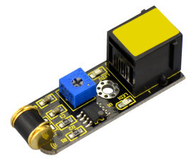
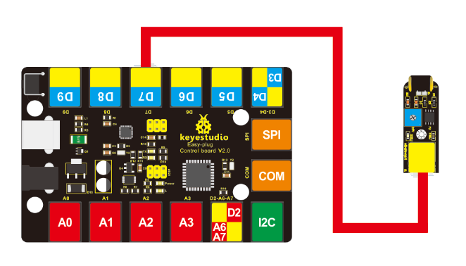
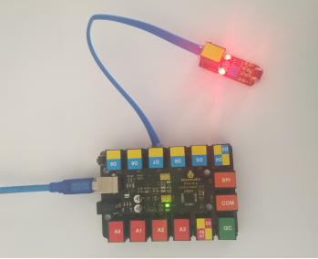

# KS0117 keyestudio EASY plug Vibration Sensor Module



## 1. Introduction

What's the simplest way to check vibration with Arduino? Well, use a vibration sensor from keyestudio.

You can directly connect it to our EASY Plug control board with only one cable. Just vibrate this sensor, Arduino can receive a digital signal. It is easy to count and program in Arduino.

It also comes with a potentiometer for you to adjust the sensitivity. In spite of simplicity, you can make full use of it with creative thinking, step counting, and crash warning light, etc. This module should be used together with EASY plug control board.

**Special Note:**

The sensor/module is equipped with the RJ11 6P6C interface, compatible with our keyestudio EASY plug Control Board with RJ11 6P6C interface.

If you have the control board of other brands, it is also equipped with the RJ11 6P6C interface but has different internal line sequence, can’t be used compatibly with our sensor/module.

## 2. Parameters

- Sensor type: Digital
- Supply Voltage: 3.3V to 5V
- High quality connector
- Adjustable sensitivity via a potentiometer

## 3. Technical Details

- Dimensions: 46mm * 16.7mm * 17.6mm
- Weight: 6.2g

## 4. Connect It Up

Connect the EASY Plug vibration sensor to control board using an RJ11 cable. Then connect the control board to your PC with a USB cable.



## 5. Upload the Code

Download code:  [Code](./Code.7z)

```c
#define SensorLED 13
#define SensorINPUT 7  //Connect the sensor to digital Pin 7 which is Interrupt 1.
unsigned char state = 0;

void setup()
{
   pinMode(SensorLED, OUTPUT);
   pinMode(SensorINPUT, INPUT);
   attachInterrupt(1, blink, FALLING);// Trigger the blink function when the falling edge is detected
}

void loop()
{  
    if(state!=0)
    {
       state = 0;
       digitalWrite(SensorLED,HIGH);
       delay(500);
    }  
    else
       digitalWrite(SensorLED,LOW);
}

void blink()//Interrupts function
{ 
	state++;
}
```

## 6. Result

Done uploading the code, just vibrate the sensor, Arduino can receive a digital signal, and led will be turned on. If isn’t, you are able to adjust the sensitivity by a potentiometer.

